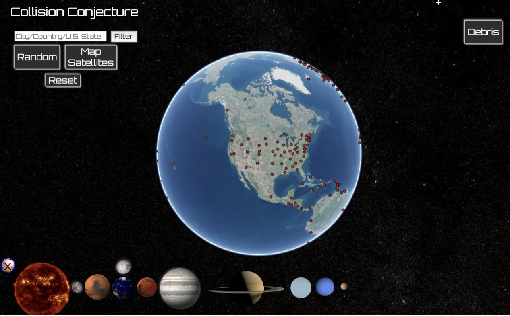
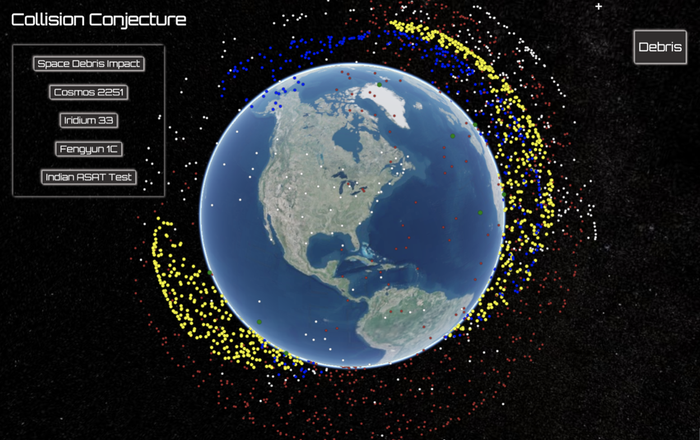
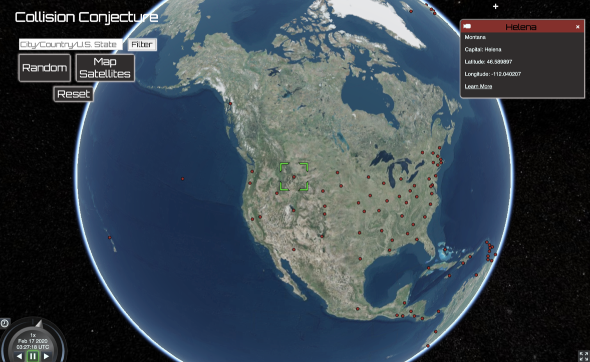
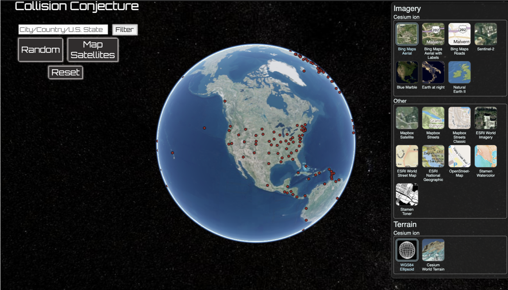
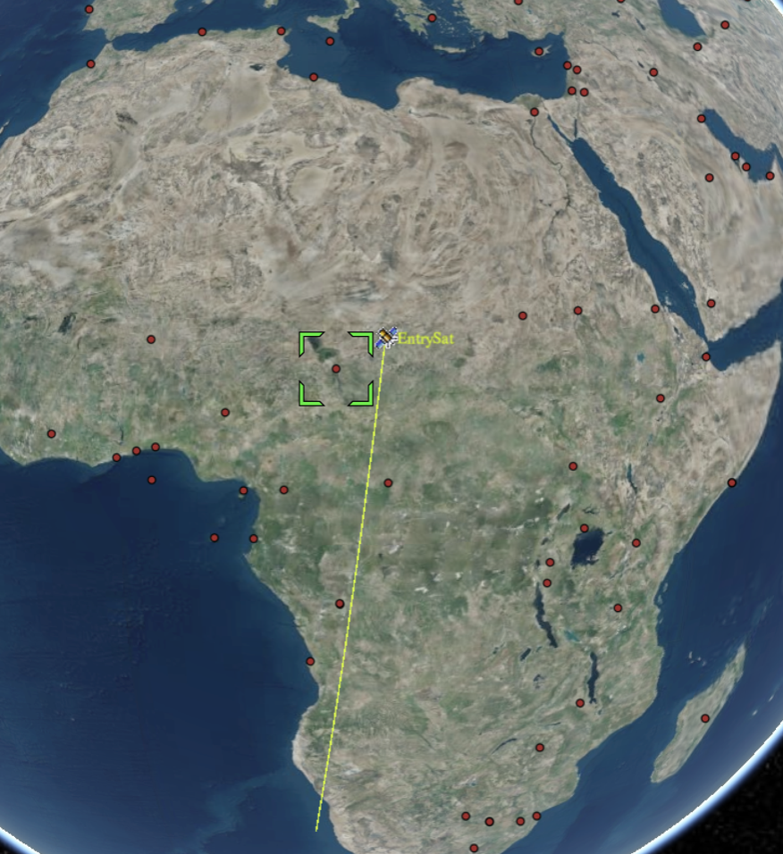
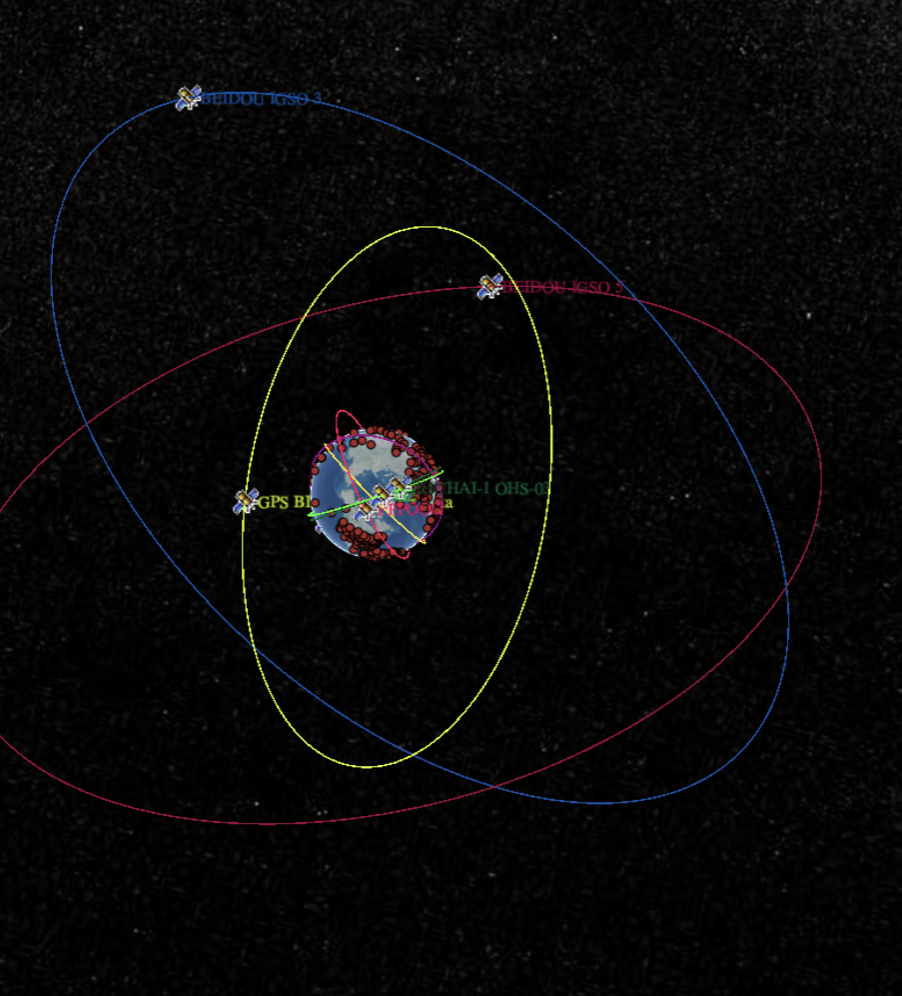
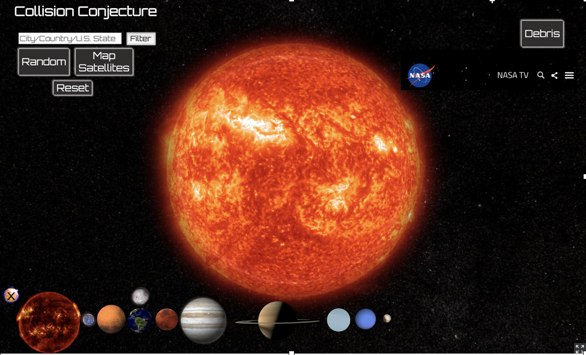
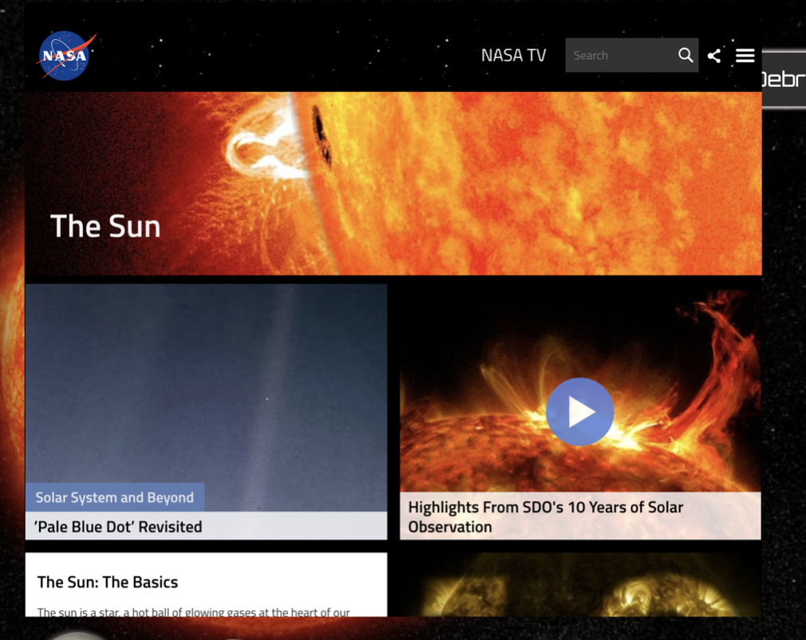
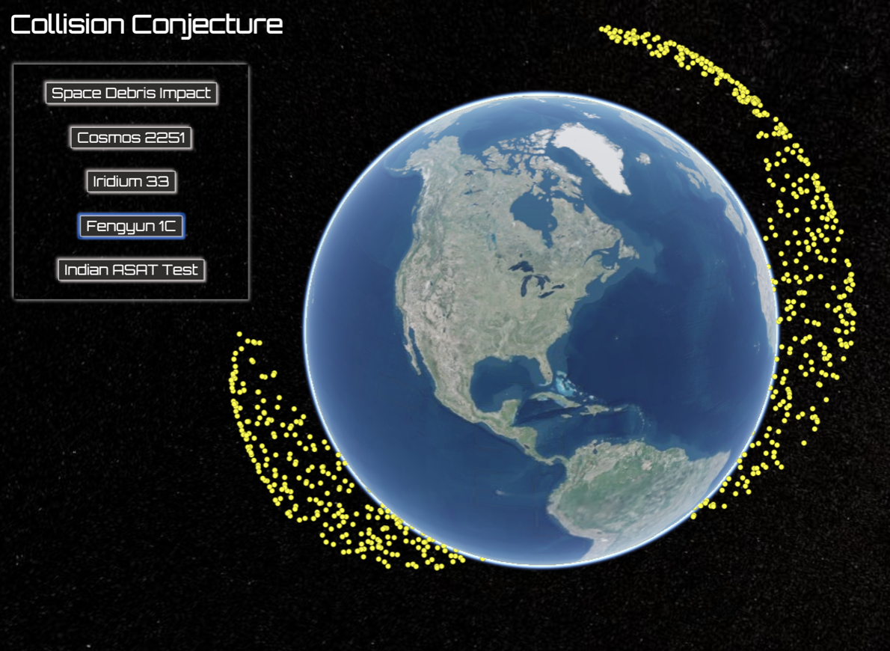

A complex visualization of the Earth in 3-D with the capability to view other planets, space debris, and map satellite trajectories in real-time.  

## Video Walk Through

* [Walk Through Video](https://www.youtube.com/watch?v=_EJAylseR3s)

## Motivation

Mapping satellite trajectories in real-time requires efficient rendering which React was built for using the React Dom. Satellites are integral to everyday life so I felt it was important to provide an accurate visualization of where satellites are in relation to your specified location and all around the globe. Space Debris is a growing issue that has received increasing publicity because it could lead to [Kessler Syndrome](https://www.nasa.gov/centers/wstf/site_tour/remote_hypervelocity_test_laboratory/micrometeoroid_and_orbital_debris.html).  

## Getting Started

If you wish to fork/clone the repo, do so in conjunction with the backend found at [BackEnd Repo](https://github.com/miriamgrigsby/collision-conjecture-backend). 

### Ruby Version 

ruby 2.6.1p33 (2019-01-30 revision 66950) [x86_64-darwin19]

### Rails Version

Rails 6.0.2.1

### Tech Stack

Ruby on Rails Backend with a SQLite3 database 

React Frontend 

### Installation

The app back is built with Ruby on Rails which requires the following commands to run: 

    Run bundle to install the gems if using Bundler
    
    Run rails db:migrate
    
    Run rails db:seed

    Run rails s to start the server
    
The app front is built with the JavaScript Library React requires the following commands to run: 
    
    Run npm install
    
    yes or y to run on a different server 
    
### Dependencies/Node Packages

The app requires the JavaScript package Cesium and the react version Resium as well as their dependencies listed below: 

    npm install --save @craco/craco craco-cesium craco-plugin-react-hot-reload cesium resium
    
    npm install react-hot-loader
    
### Features

The two main features of the app are satellite trajectory mapping in real-time and the visualization of space debris. 

### Operation Overview

The user can click on any dot which represents the capital city of every country in the world and all 50 states. This brings up a pop-up of more information with a link to a google search about that city. The filter on the left of the home page allows the user to search only for the red dots, and filters by city name or country name. Upon enter, the globe turns to the location and zooms in. Upon reset or mapping of random satellites, the globe will zoom out and return to the default location in the United States. 

A single dot must be clicked by the user before a satellite can be mapped, then pressing the map satellite button will create the trajectory of one random satellite. To learn more about this function see the Satellites Overhead section below. To reset, or view another satellite, press the reset button. Choose random to view 8 random satellites entire trajectories around the globe. See the Satellite in Real time section below for more. The spinning planets at the bottom are all buttons that render an image of that planet over the current globe and an embedded mini-NASA page. See Planet and NASA section. Clicking the debris button will change the users view. See Debris below for more information about this feature. 

### Cesium/Resium Features

Cesium and Resium along with their dependencies are responsible for rendering the globe view. They allow the user to zoom in and out, play out the satellite trajectories with a special play button, and change the view based on the tool bar. In the upper right hand corner, the plus sign opens a cesium/resium toolbar. The search uses bing maps to find any place on Earth and zooms into a street view upon entering the location. The user can change the view to flat map projection instead of globe, or change the background image based on special imagery provider images. The help section also shows users ways to interact with the map using their keyboard or trackpad/mouse.

### Satellites Overhead

The map satellite button chooses a single random satellite that could view the specified location sometime in 2018. If the randomly populated satellite does not view the chosen location, press reset and repeat the process. Sometimes, the satellite has a very wide orbit, so be sure to zoom out to check before moving on. Press the play button to show the satellites movement over its trajectory. Speed it up by moving the dial slightly above the play button. Click on the satellite to find out more about it. 

### Satellites in Real Time

Click on the random button to choose 8 random satellites and their locations in real time. Press play in the bottom left of the home page to view their projected paths from now to exactly 24hrs from now. Zoom in and out, rotate around to see different perspectives, and click on an individual satellite to learn more. Speed it up by moving the dial slightly above the play button. Press reset and do it all over again. 

### Planets and NASA

Click on a planet to show an image infront of the globe with an embedded NASA page that links to a search about that planet. Hover over the NASA section to see the search results, or go anywhere else on the NASA site. The user can even play videos on the site. Move the mouse off of the NASA section to minimize it. Make sure to click the spinning planet button again to remove it from view. 

### Debris
    
From the home page, clicking the Debris button will switch your view to the earth surrounded by debris. The initial debris represents a single piece above every country in the world and every state in the United States. From there, the debris buttons on the left can be clicked to render the major kinds of space debris. Clicking the top Impact button will show an approximation of all the space debris above the planet, though the real number is closer to 20,000. Each kind of debris is a different color to represent the amounts based on type and altitude. This feature does NOT use real data, though it could be mapped using the same data and packages as the satellites. Instead, it is meant as a visualization of the impact people have on space and to bring attention to the implications this damage may have in the future. 

### Notes about Satellite Mapping

To actually map the satellites, see the Globe.js component. Fetches were made in App.js to the respective APIs and to the backend where the locational data was store. Those responses were saved to state and passed down to Globe. There, several Cesium/Resium items are imported for use. The Viewer controls what you see (background image of Earth, the spinning etc). The Entity must be placed inside the Viewer and that renders each red dot shown. Map through the backend fetch response prop and create an Entity for every item in the the array. Convert the API fetch data to CZML data for satellite mapping. Each Entity must have a position using the Cartesian 3 (though the 3rd option, altitude, is not necessary), point (this is set above with a color and size). The onClick action is what allows the user to click on a spot which sets the state of latitude and longitude to map the satellites based on location. The description determines what is located in the pop-up that comes up when a dot is clicked on. Render the satellite trajectory by adding a CzmlDataSource component to the Viewer. The CameraFlyTo component is used to spin the globe to the location when the user uses the filter function or maps satellites. The Cesium documentation is confusing and does not always correctly translate to Resium (using Cesium in React). Follow the same format as the return section of Globe.js to make most features Cesium offers work for what you need. 
